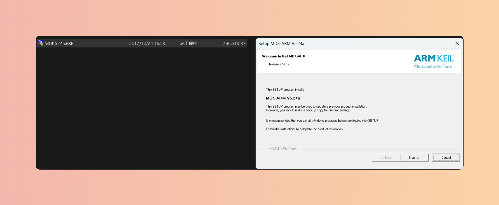
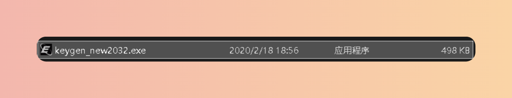
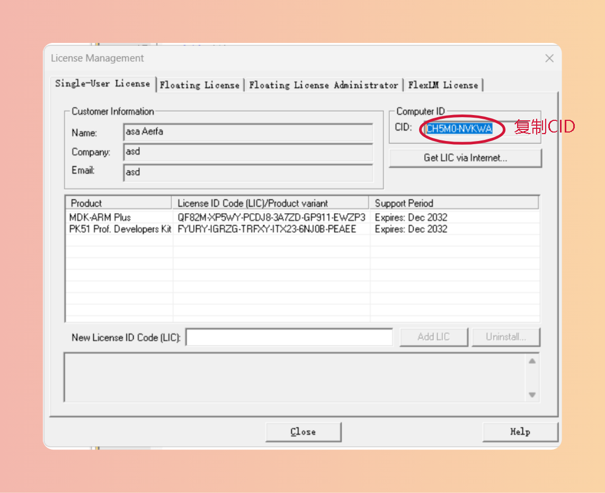
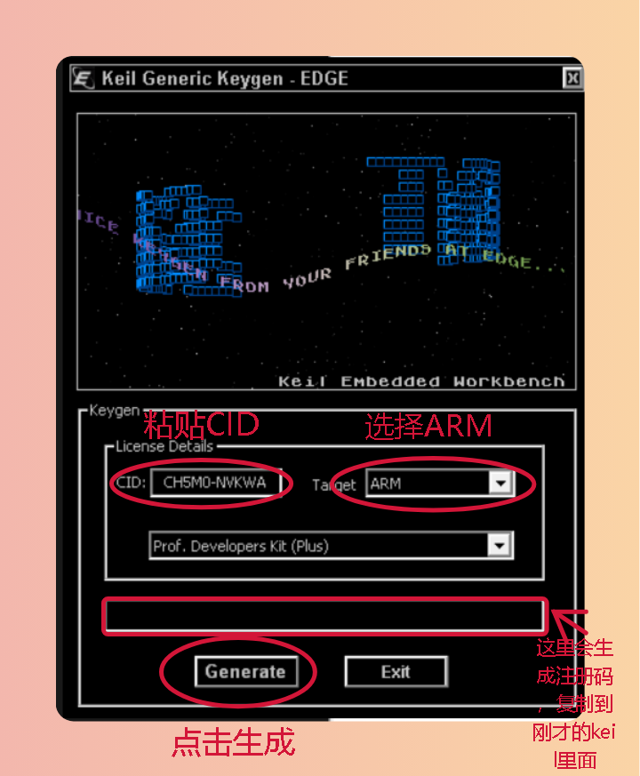
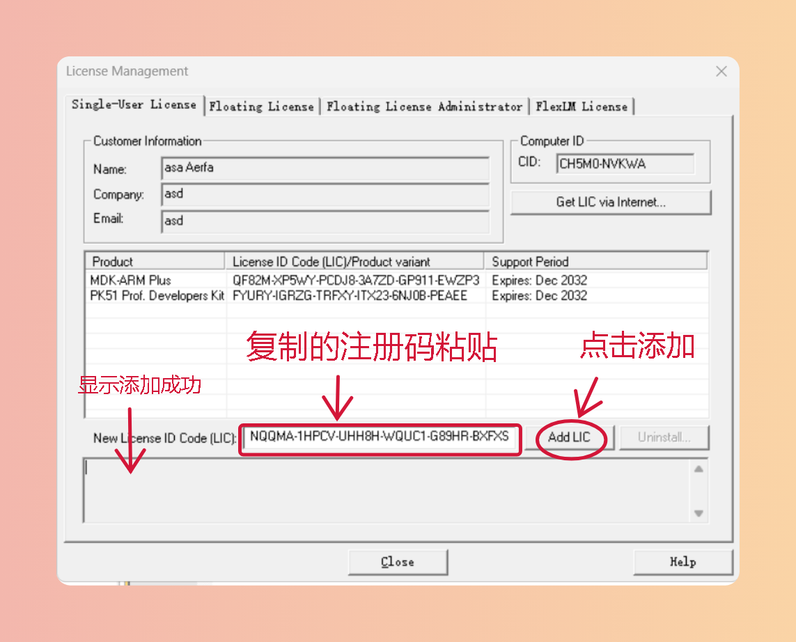
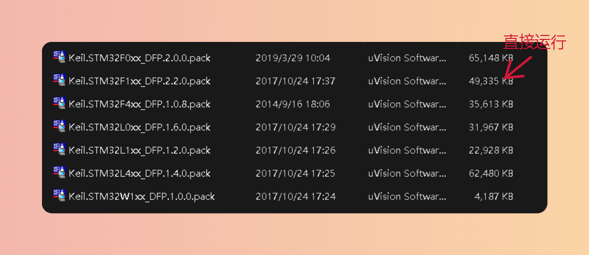
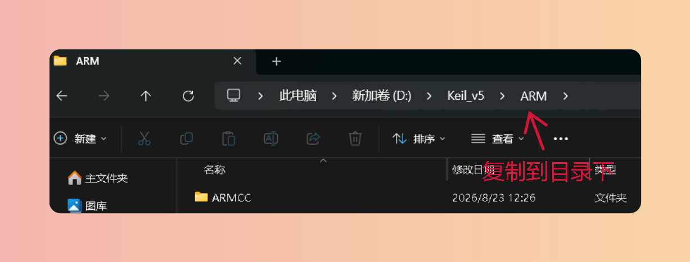
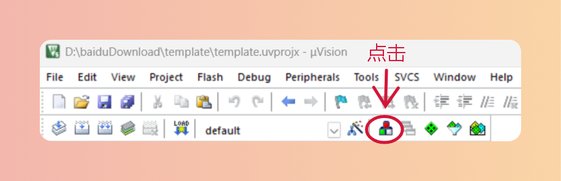
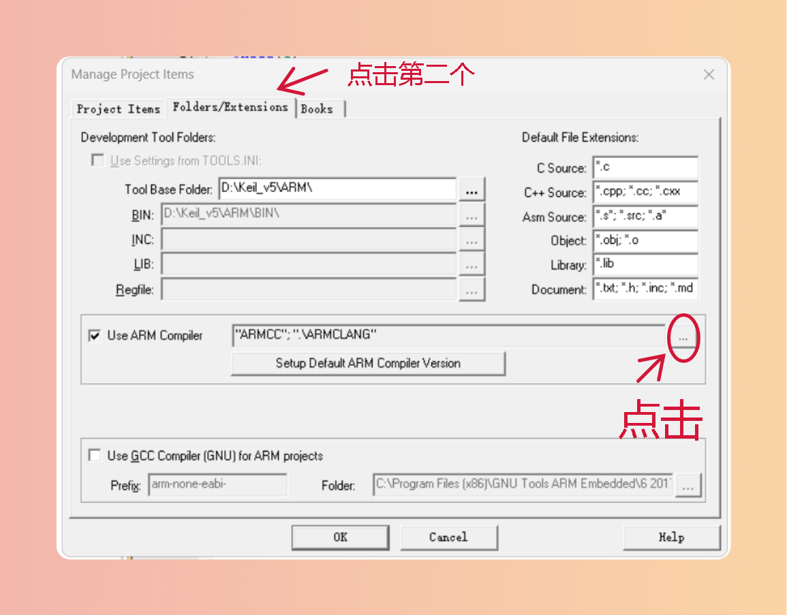
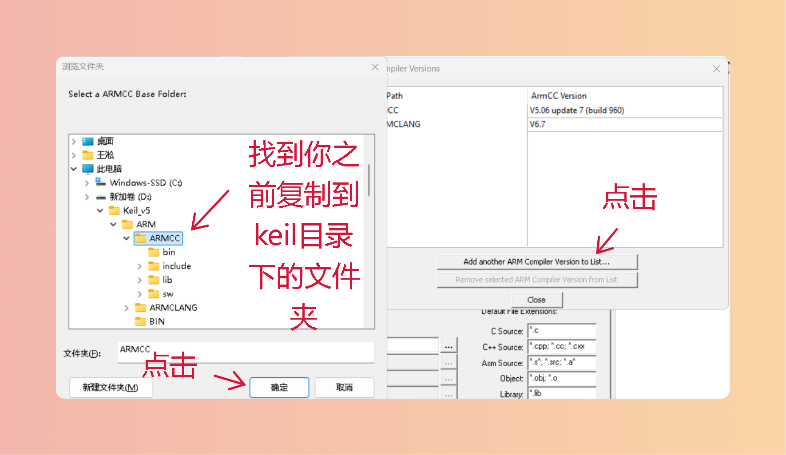

# STM32-环境搭建
> keil软件安装

> 软件破解
以管理员身份运行破解软件和keil,在keil软件找到File下的licence Management,复制CID去破解软件

> 回到破解软件界面

> 再去keil的License Management

> 添加支持包

> 解压ARMCC将其放到keil/ARM目录下(如果有就不用复制了)

> 如果keil安装完上述东西之后运行会报错的话，以下为解答方法

