[Function](#Function)
# 串口的缺点
> 只能实现一对一的通信

# 结构
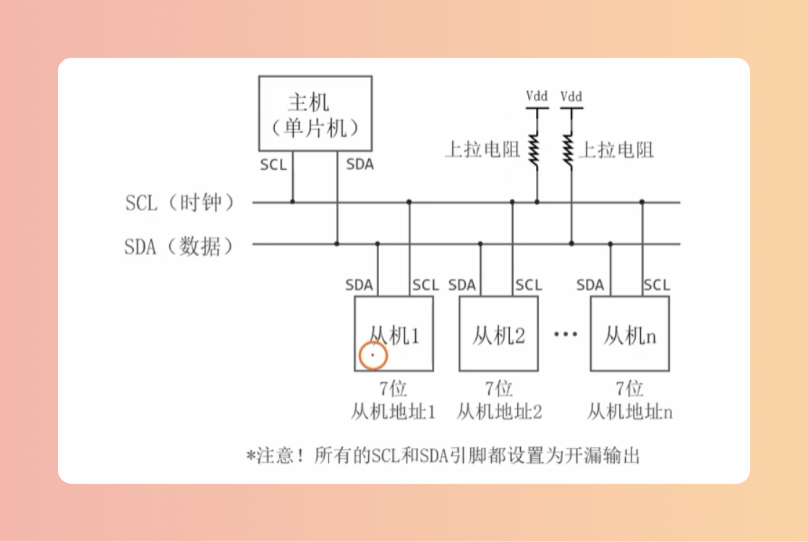

# 时钟线和数据线
> SCL:时钟线控制传输的时间 - SDA:数据线控制传输的数据

# 逻辑线与
> 以硬件电路的形式实现逻辑与&，强下拉弱上拉

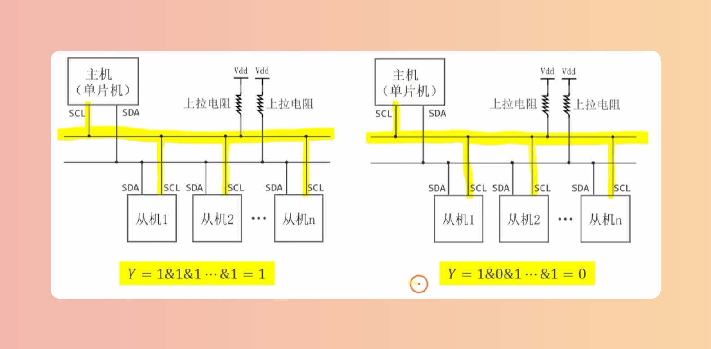

# 通信流程
> 主机向从机写数据**0**，从机向主机读数据**1**

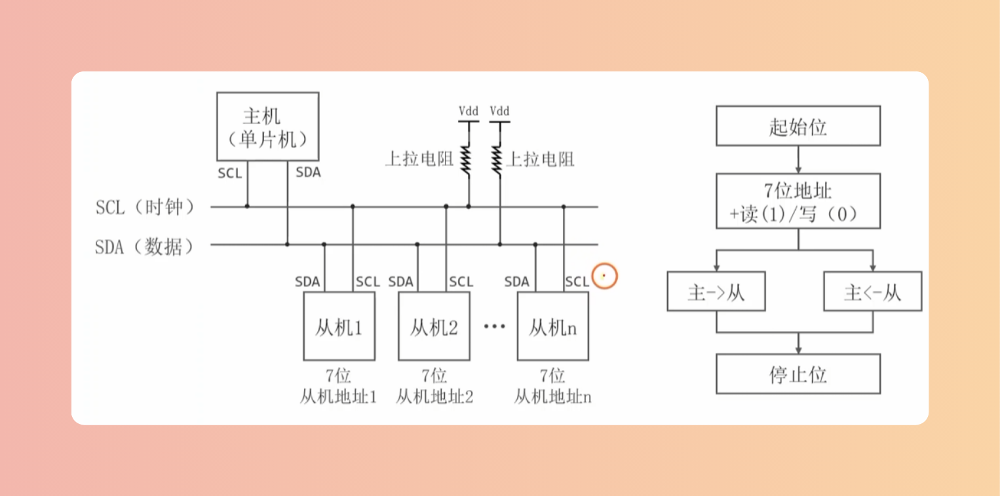

# 数据帧格式
> 传输阶段以字节为单位，一次性可以传输多个字节，因为是7位地址，范围是0-127，一共128

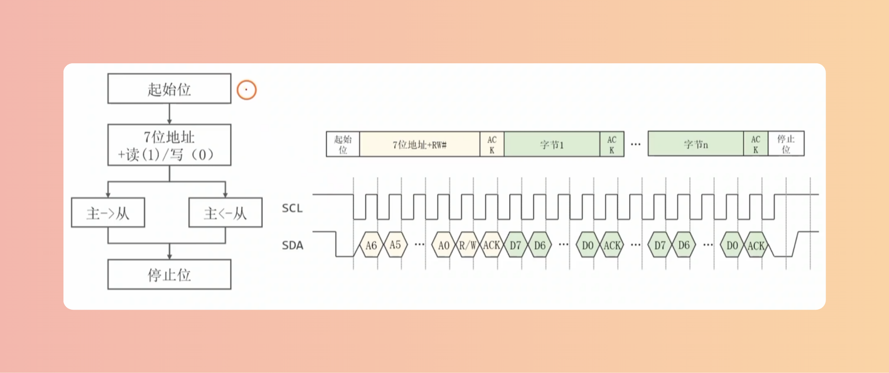

## 起始位和停止位
> 起始位：SCL为高电压时，SDA拉低电压，出现下降沿
> 停止位：SCL为高电压时，SDA拉高电压，出现上升沿

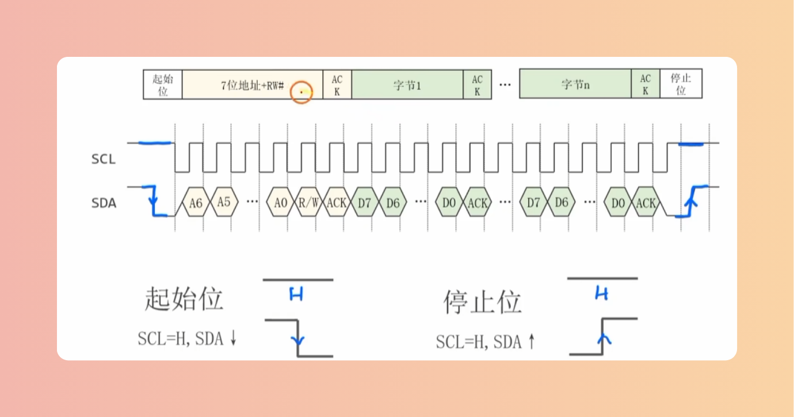

# 寻址
> 黄色区域为寻址区域，起始位之后，数据传输之前，写是0读是1

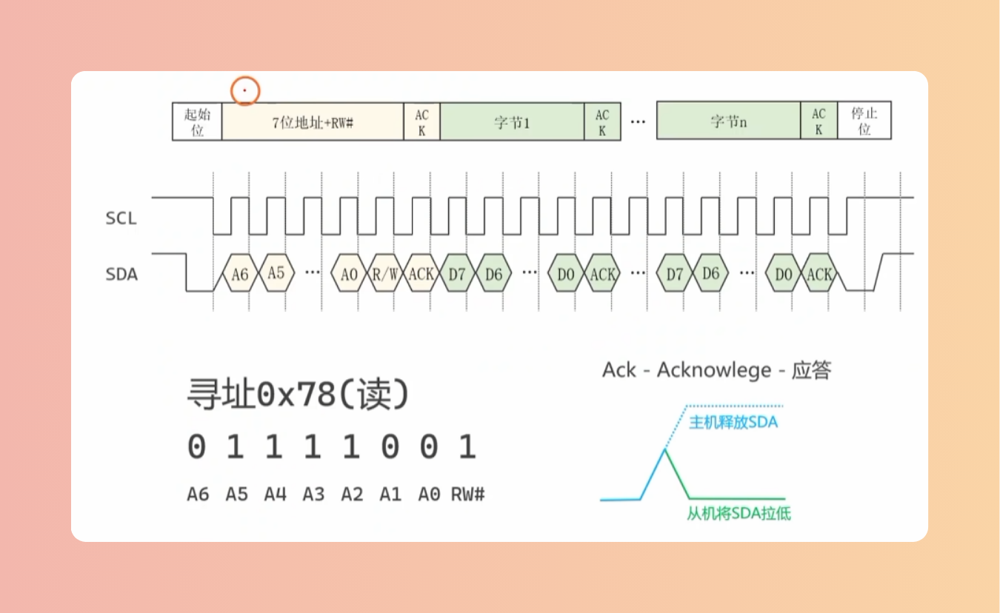

# 发送数据
> 发送一个字节之后接ACK，发送方SDA=1，接收方SDA=0
> 当发送一个数据之后不再发送，可以不需要ACK，保持高电压，主机发送停止位NAK，表示不应答

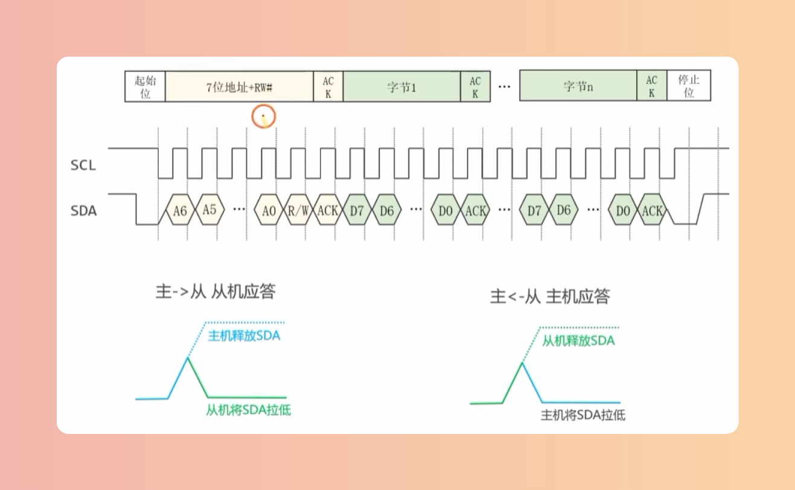

# I2C模块
> 是一个通信接口，有两个引脚为：SCL和SDA

# 速度模式
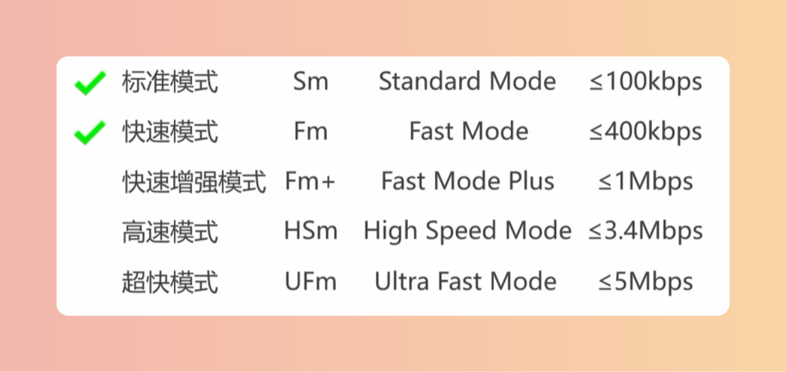

# 时钟信号的占空比
> 只有快速模式下可以设置时钟信号的占空比

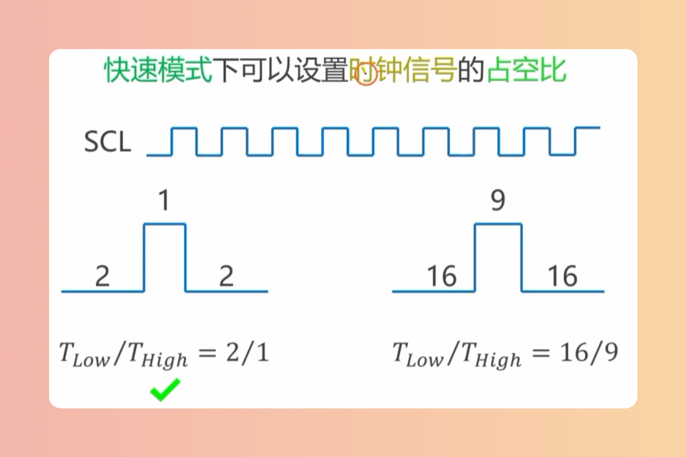

# I2C总开关
> 只有闭合总开关I2C才能正常传输数据

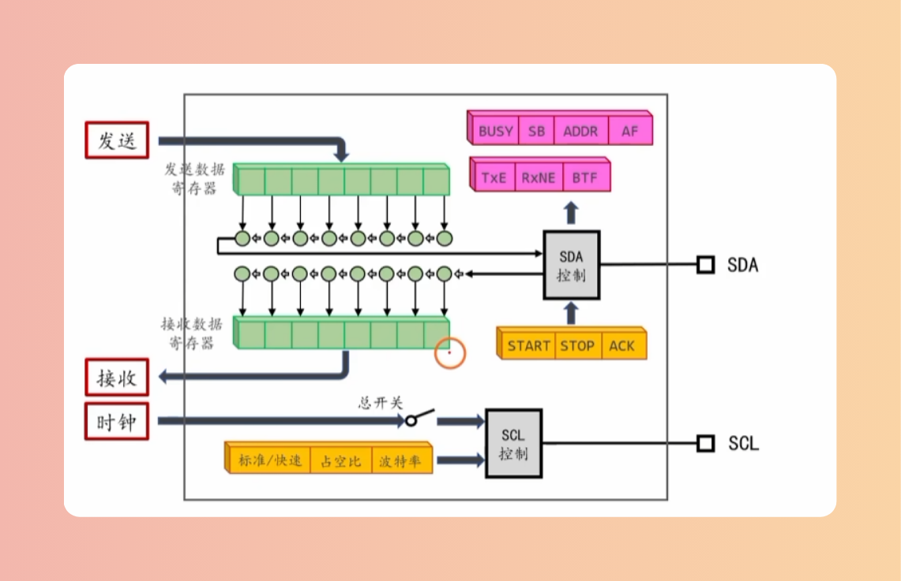

## 结构框图
> 串并转换和串口通信比较相像

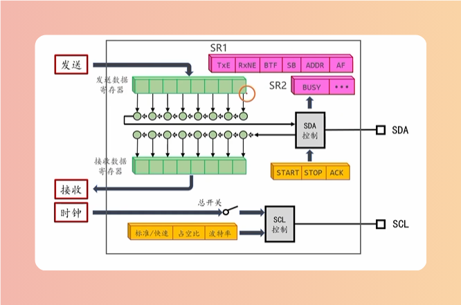

# Function
## I2C_Init
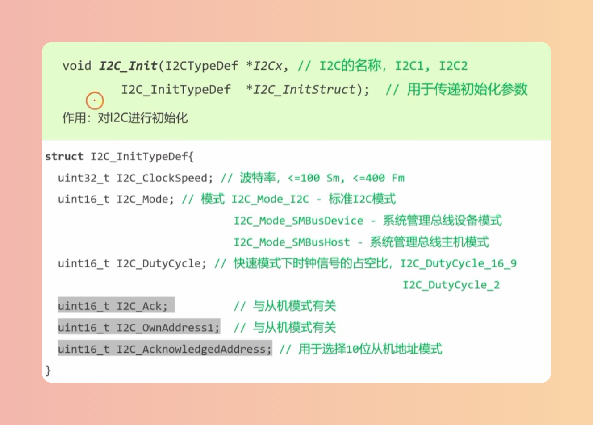

## 发送数据
> 主 -》 从

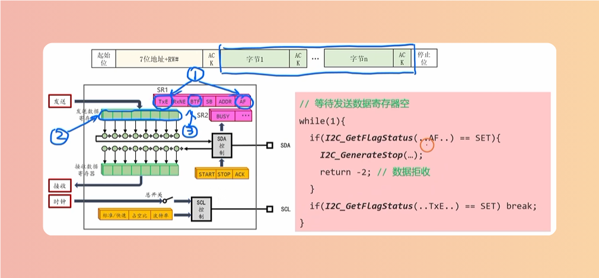

## 软I2C
> 可以使用其他的引脚充当SCL和SDA，通过发送I2C的数据帧格式可以模拟一个软I2C,代码在04-1-SoftwareI2CTest目录下main.c文件

### I2C_GetFlagStatus
> 同USART一样
> 可查阅数据手册I2C模块了解标志位

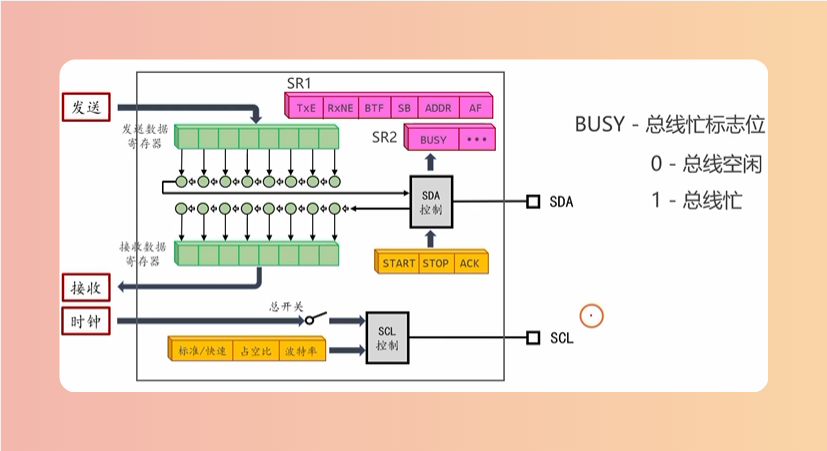

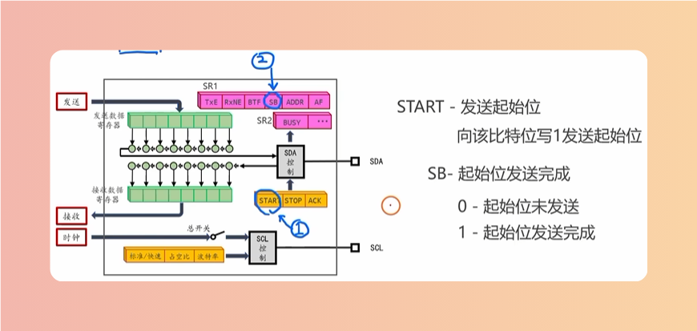

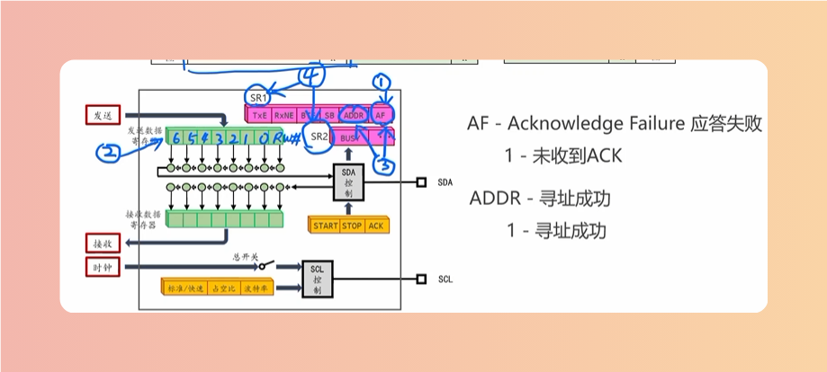


### My_I2C_SendBytes(自定义)
> 向I2C发送数据的一个流程

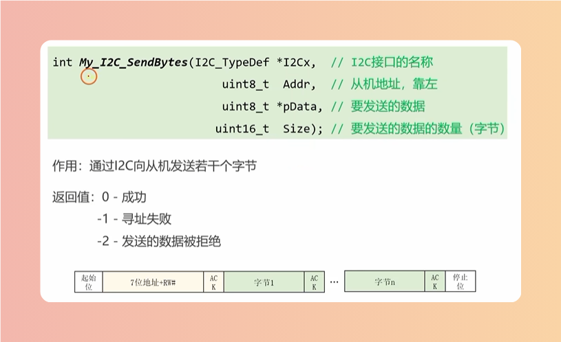

```
//	#1.	等待总线空闲
	while(I2C_GetFlagStatus(I2Cx, I2C_FLAG_BUSY) == SET);
	
	//	#2. 发送起始位
	I2C_GenerateSTART(I2Cx, ENABLE);
	
	//	起始位发送完成
	while(I2C_GetFlagStatus(I2Cx, I2C_FLAG_SB) == RESET);
	
	//	#3. 寻址阶段
	I2C_SendData(I2Cx, Addr);
	
	while(1)
	{
		if(I2C_GetFlagStatus(I2Cx, I2C_FLAG_ADDR) == SET)
		{
			break;
		}
		if(I2C_GetFlagStatus(I2Cx, I2C_FLAG_AF) == SET)
		{
			I2C_GenerateSTOP(I2Cx, ENABLE);
			return -1;	// 寻址失败
		}
	}
	
	//	清除ADD(先读SR1，再读SR2)
	I2C_ReadRegister(I2Cx, I2C_Register_SR1);
	I2C_ReadRegister(I2Cx, I2C_Register_SR2);
	
	// #4. 发送数据
	for(uint16_t i = 0; i < Size; i++)
	{
		while(1)
		{
			if(I2C_GetFlagStatus(I2Cx, I2C_FLAG_AF) == SET)
			{
				I2C_GenerateSTOP(I2Cx, ENABLE);
				return -2;	//	数据被拒收
			}
			if(I2C_GetFlagStatus(I2Cx, I2C_FLAG_TXE) == SET)
			{
				break;
			}
		}
		I2C_SendData(I2Cx, pData[i]);
	}
	
	while(1)
	{
		if(I2C_GetFlagStatus(I2Cx, I2C_FLAG_AF) == SET)
		{
			I2C_GenerateSTOP(I2Cx, ENABLE);
			return -2;	//	数据被拒收
		}
		if(I2C_GetFlagStatus(I2Cx, I2C_FLAG_BTF) == SET)
		{
			break;
		}
	}
	I2C_GenerateSTOP(I2Cx, ENABLE);
	
	return 0;
```

## 接收数据
> 从 -》 主 停止位前发NAK

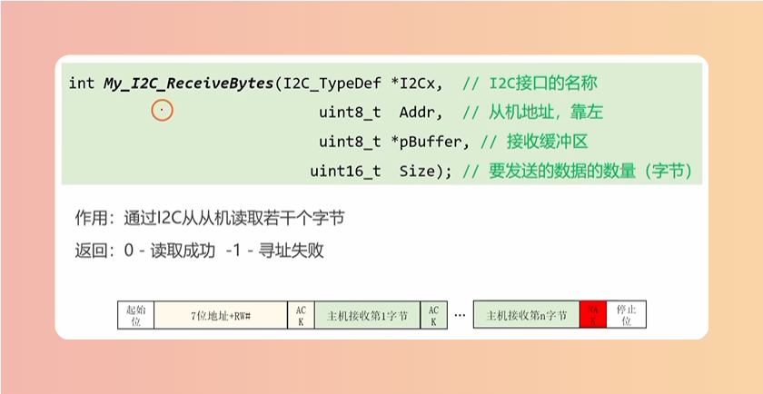

### I2C_GetFlagStatus

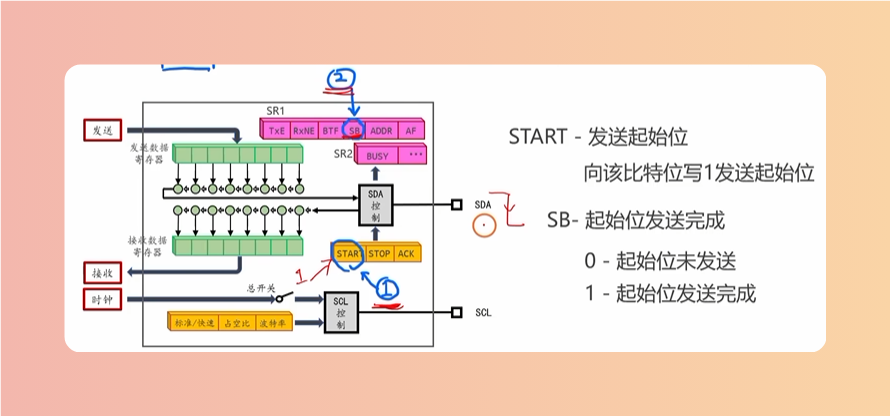

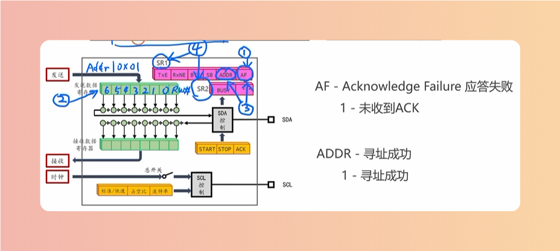

> 只作用于正在接收的数据

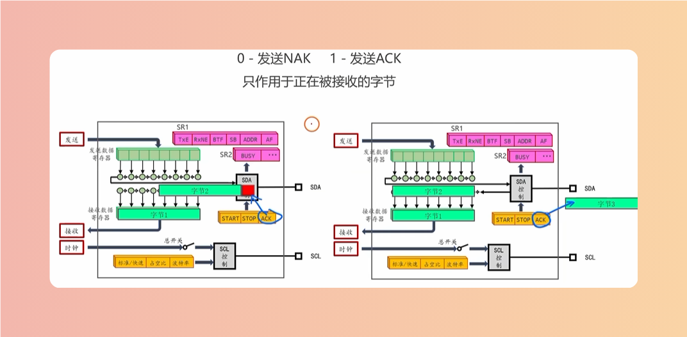

> 当数据接收完之后(当前字节接收完成之后)

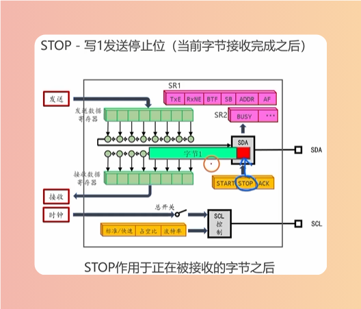

### 字节发送

> 1个字节

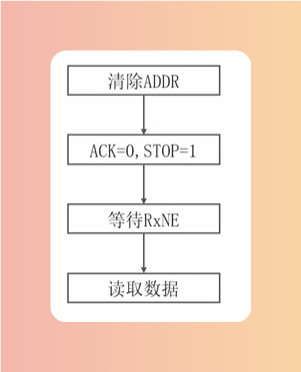

> 2个字节

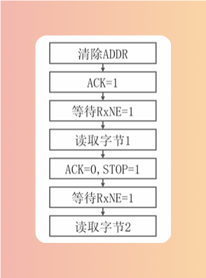

> 多个字节

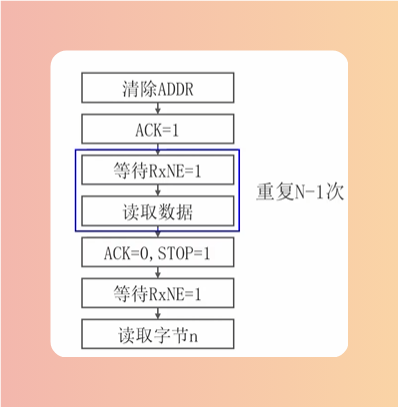

### My_I2C_ReceiveBytes（自定义）
```
//	#1. 发送起始位
	I2C_GenerateSTART(I2Cx, ENABLE);
	
	while(I2C_GetFlagStatus(I2Cx, I2C_FLAG_SB) == SET);
	
	//	#2. 寻址阶段
	I2C_ClearFlag(I2Cx, I2C_FLAG_AF);
	
	I2C_SendData(I2Cx, Addr | 0x01);
	
	while(1)
	{
		if(I2C_GetFlagStatus(I2Cx, I2C_FLAG_AF) == SET)
		{
			I2C_GenerateSTOP(I2Cx, ENABLE);
			return -2;	// 数据被拒收
		}
		if(I2C_GetFlagStatus(I2Cx, I2C_FLAG_ADDR) == SET)
		{
			break;
		}
	}
	
	//	#3. 接收数据
	if(Size == 1)
	{
		//	清除ADDR
		I2C_ReadRegister(I2Cx, I2C_Register_SR1);
		I2C_ReadRegister(I2Cx, I2C_Register_SR2);
		
		//	ACK = 0	STOP = 1
		I2C_AcknowledgeConfig(I2Cx, DISABLE);
		I2C_GenerateSTOP(I2Cx, ENABLE);
		
		//	RxNE -> 1
		while(I2C_GetFlagStatus(I2Cx, I2C_FLAG_RXNE) == RESET);
		
		//	读取数据
		pBuffer[0] = I2C_ReceiveData(I2Cx);
	}
	else if(Size == 2)
	{
		//	清除ADDR
		I2C_ReadRegister(I2Cx, I2C_Register_SR1);
		I2C_ReadRegister(I2Cx, I2C_Register_SR2);
		
		//	ACK = 1
		I2C_AcknowledgeConfig(I2Cx, ENABLE);
		
		//	RxNE -> 1
		while(I2C_GetFlagStatus(I2Cx, I2C_FLAG_RXNE) == RESET);
		
		//	读取字节1
		pBuffer[0] = I2C_ReceiveData(I2Cx);
		
		//	ACK = 0, STOP = 1
		I2C_AcknowledgeConfig(I2Cx, DISABLE);
		I2C_GenerateSTOP(I2Cx, ENABLE);
		
		//	等待接收完成
		while(I2C_GetFlagStatus(I2Cx, I2C_FLAG_RXNE) == RESET);
		
		//	读取字节2
		pBuffer[1] = I2C_ReceiveData(I2Cx);
	}
	else
	{
		//	清除ADDR
		I2C_ReadRegister(I2Cx, I2C_Register_SR1);
		I2C_ReadRegister(I2Cx, I2C_Register_SR2);
		
		//	ACK = 1
		I2C_AcknowledgeConfig(I2Cx, ENABLE);
		
		for(uint16_t i = 0; i < Size - 1; i++)
		{
			//	等待RxNE -> 1
			while(I2C_GetFlagStatus(I2Cx, I2C_FLAG_RXNE) == RESET);
			
			pBuffer[i] = I2C_ReceiveData(I2Cx);
		}
		
		//	ACK = 0, STOP = 1
		I2C_AcknowledgeConfig(I2Cx, DISABLE);
		I2C_GenerateSTOP(I2Cx, ENABLE);
		
		//	等待接收完成
		while(I2C_GetFlagStatus(I2Cx, I2C_FLAG_RXNE) == RESET);
		
		//	读取最后一个数据
		pBuffer[Size] = I2C_ReceiveData(I2Cx);
	}
	return 0;	// 接收成功
```