[Function](#Function)
# 结构
 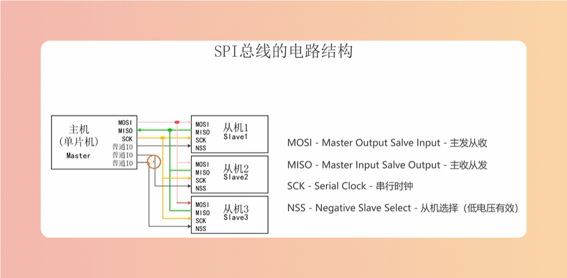

# 流程

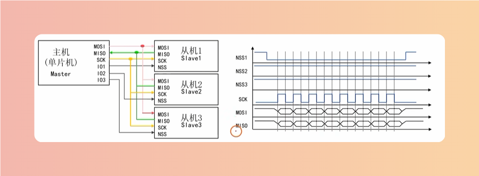

# 极性
> SCK初始为低就是低极性，为高就是高极性

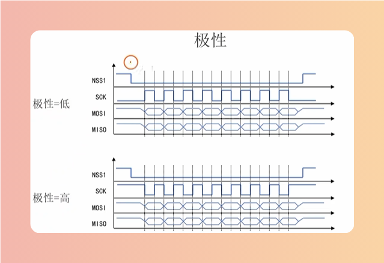

# 相位
> 低极性上升沿为第一边沿，下降沿为第二边沿。
> 高极性相反，高极性上升沿为第二边沿，下降沿为第一边沿。
> 根据采集不同的时间点可分为不同的相位

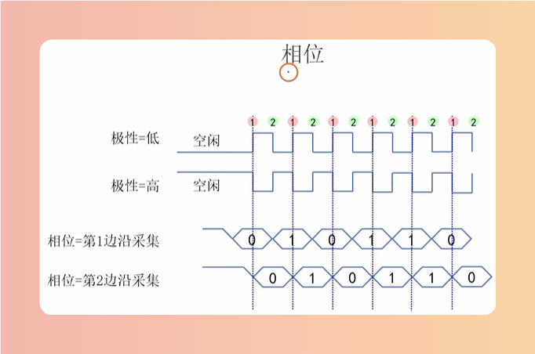

# SPI的四种时钟模式
> 极性：低0高1
> 相位：第一边沿0第二边沿1

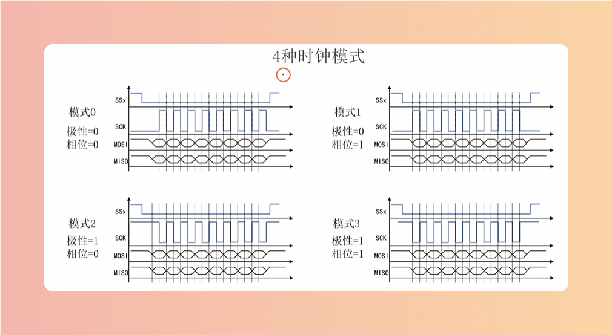

# 传输顺序
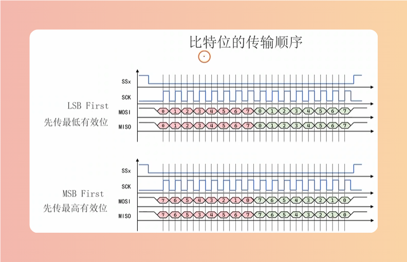

# 数据宽度
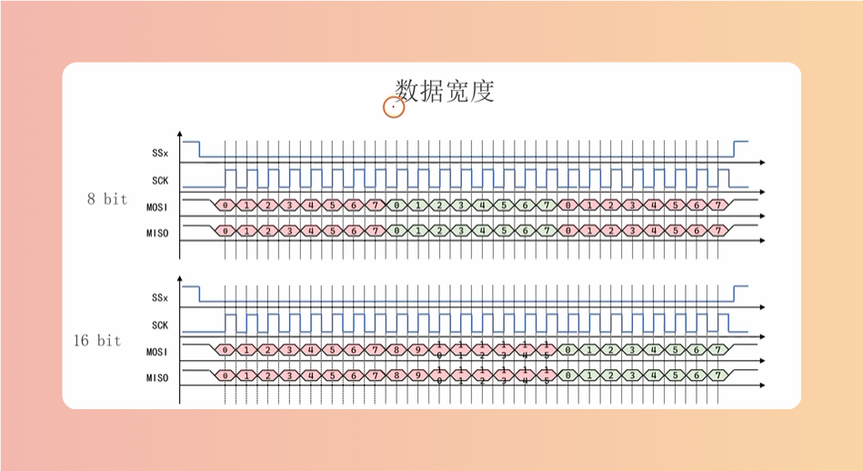

# NSS
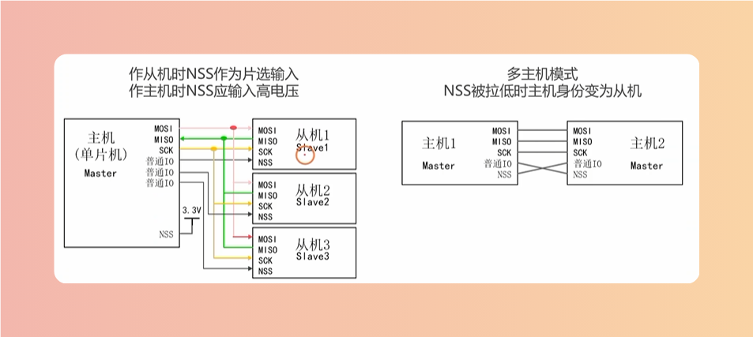

# Function
## SPI_Init
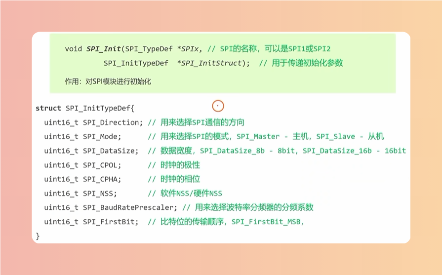

## 通信方向
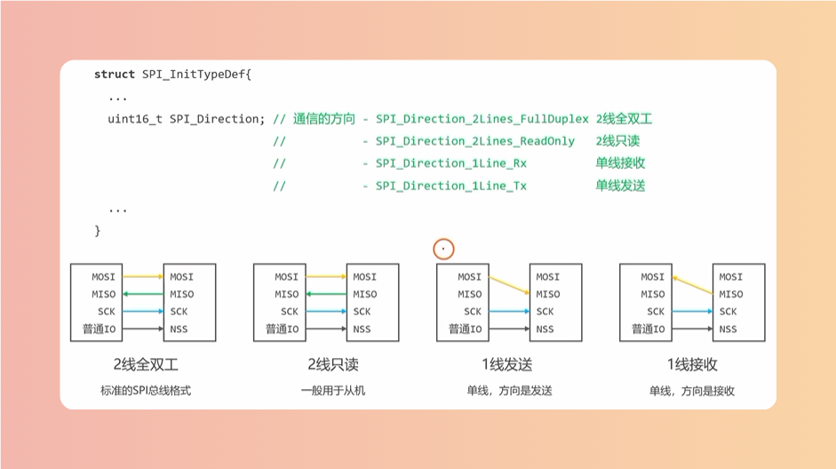

## NSS
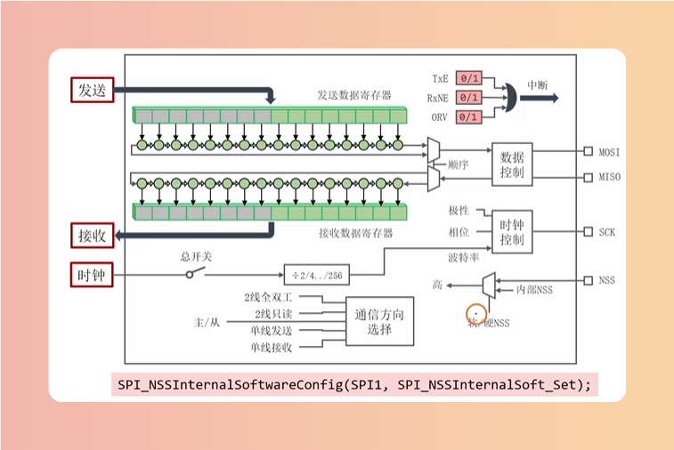

## 编程步骤
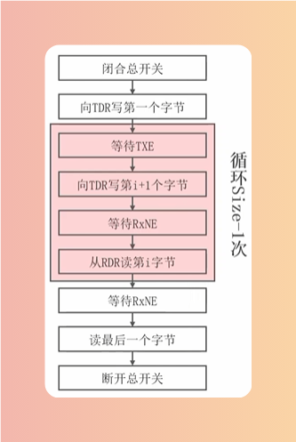

## W25Q64
>写使能
>0x06是固定值，相当于发送写使能指令

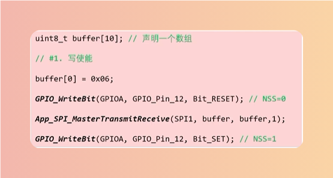

> 扇区擦除
> 主机发送0x20 + 24位地址(0x20 - 0x00 - 0x00 - 0x00), 0x20是固定值，相当于发送擦除指令

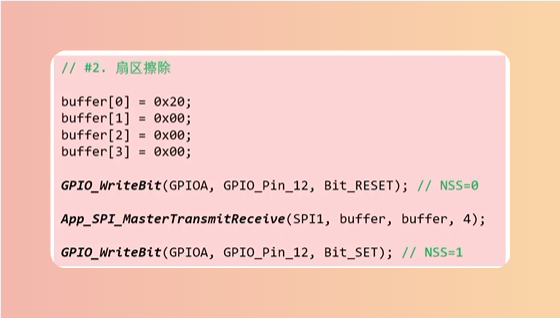

> 等待空闲
> 0x05是固定值，发送等待空闲指令， 0xff读一个字节作为状态寄存器1的值

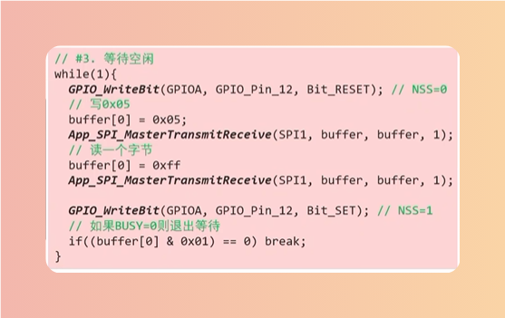

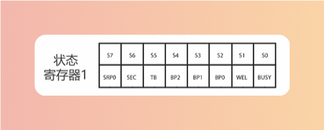

> 页编程
> 主机发0x02 + 24位地址 + 要写的数据(0x02 - 0x00 - 0x00 - 0x00 - （发送的字节最多256)), 0x02发送页编程指令。Byte为函数形参

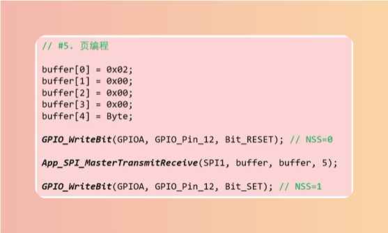

> 读取数据
> 主机发0x03 + 24位地址，然后读取数据(0x03 - 0x00 - 0x00 - 0x00)

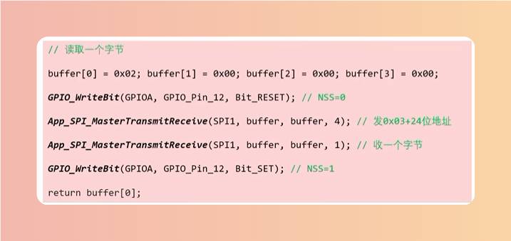