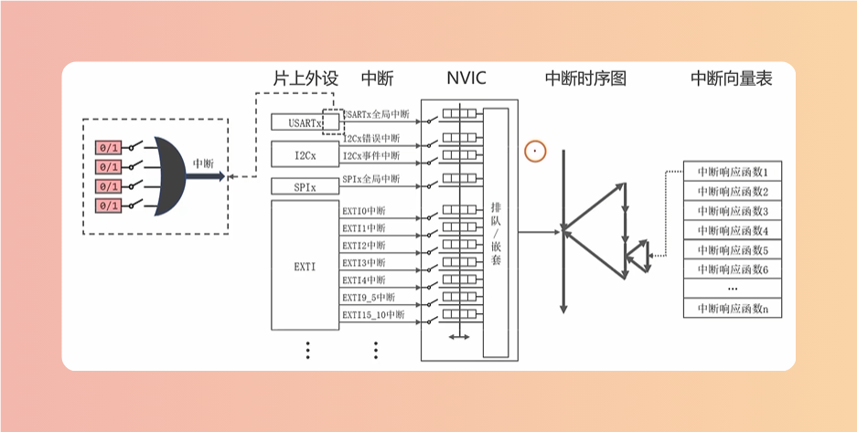
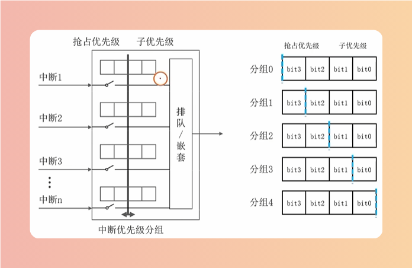
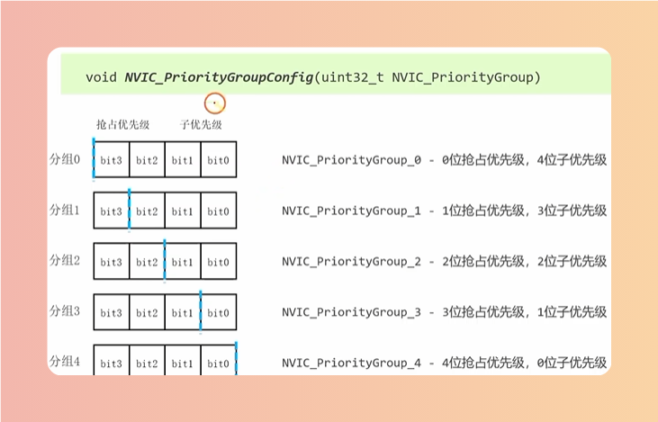
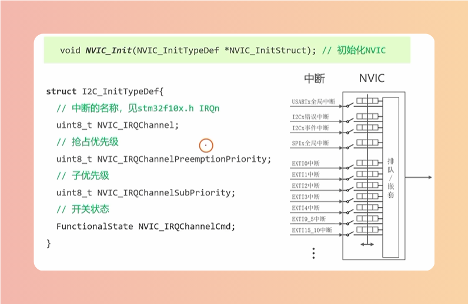
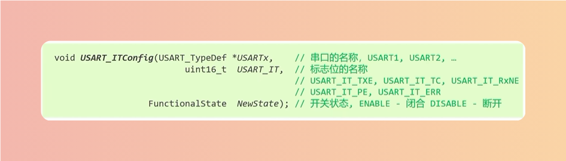

# 结构框图

# 优先级

## 中断嵌套
> 新中断的抢占优先级更高（数字越小，优先级越高）

## 中断排队
> 优先级相仿，等待前一个中断执行完再处理新中断（不会打断程序，而是等程序执行完之后，按优先级高的来排队执行，优先级相同则是先来后到）

# 中断定义
> 在startup_stm32f10x_md.s文件查看对应的中断函数

## NVIC
> 嵌套向量控制器，专门管理中断，属于内核，不需要开启,通常写在main函数的开头
> 1：配置分组
> 2：设置优先级
> 3：闭合开关

### 分组

### 设置优先级

# Function
## 中断闭合开关

