[USART_Function](##Function)
# 串口的概念
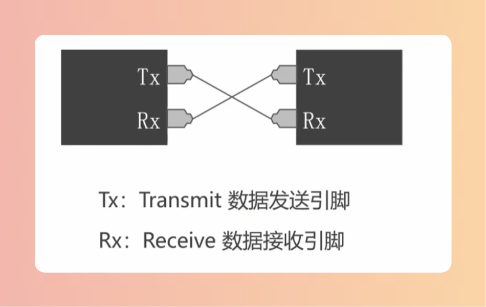

# 通信协议
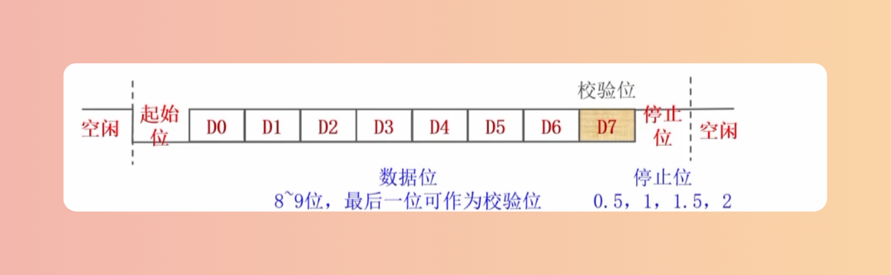
> 通常采用无校验位的8位数据位和有校验位的9位数据位

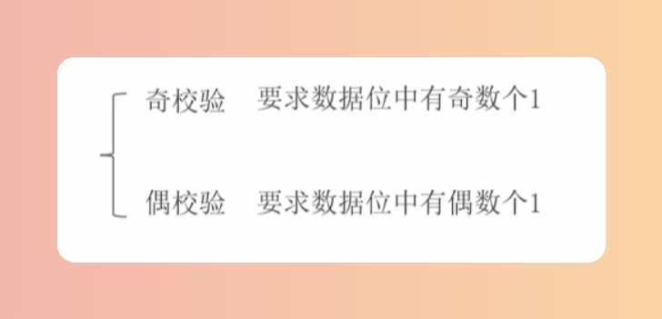

# USART模块
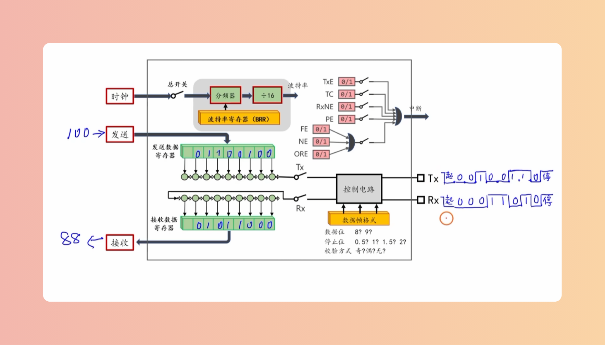

## 移位寄存器和串并转换
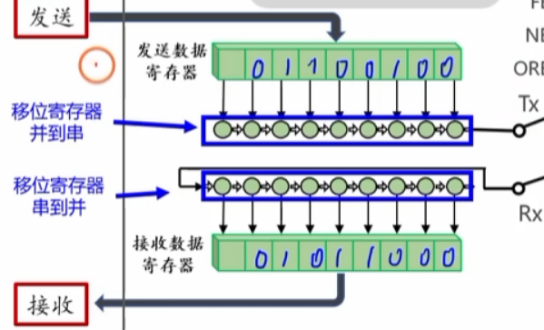
> 并到串：从末端一个一个右移输出
> 串到并：从左到右一个一个读取

## 数据帧
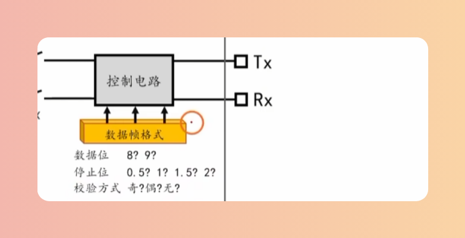

## 波特率
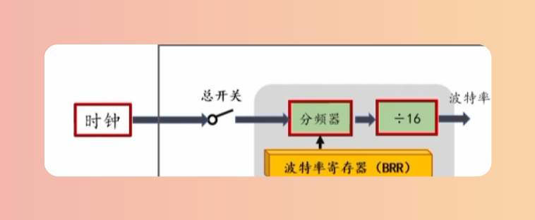

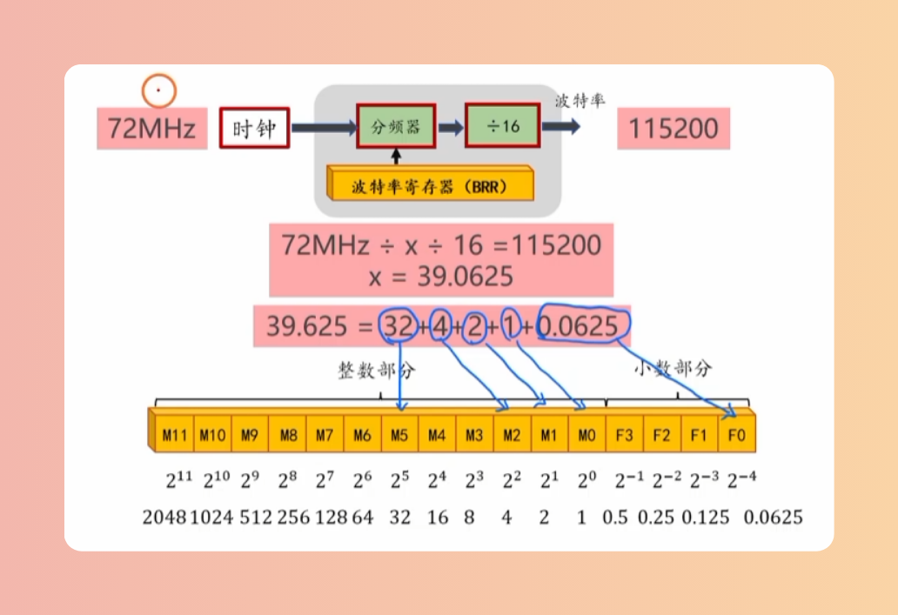
> x：波特率寄存器
x决定分频器

## 引脚分布表
> DS5319 stm32f10x中等密度mcu数据手册（英文）P28

## 重映像
> RM0008 STM32F10xxx参考手册（中文）8.3节

## 引脚配置
> RM0008 STM32F10xxx参考手册（中文）8.1.11节

## 全双工，半双工，同步
**全双工**：数据传输是双向的，可以同时进行。（最好使用上拉输入）  

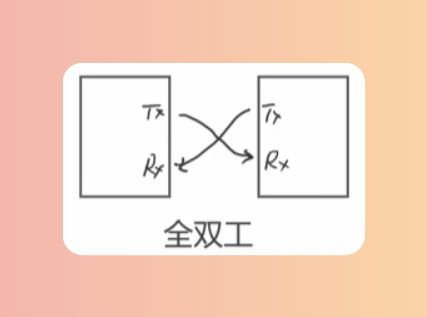

**半双工**：数据传输是双向的，但不可以同时进行。  

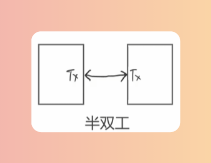

**同步**：在标准的串口基础上增加一根ck线，在两个设备之间进行时钟信号的传输，同步两个设备。  

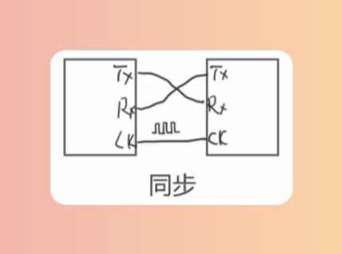

**硬件流控**：在标准的串口基础上增加两个引脚(CTS/RTS)，这两个引脚也是交叉元件。  

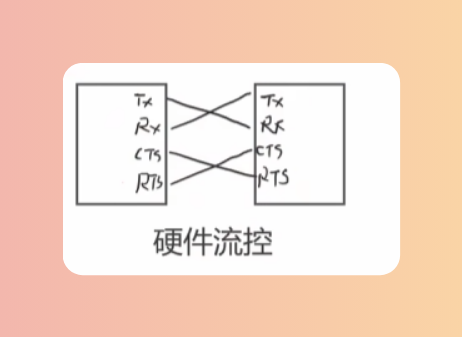

## Function

### USART_Init
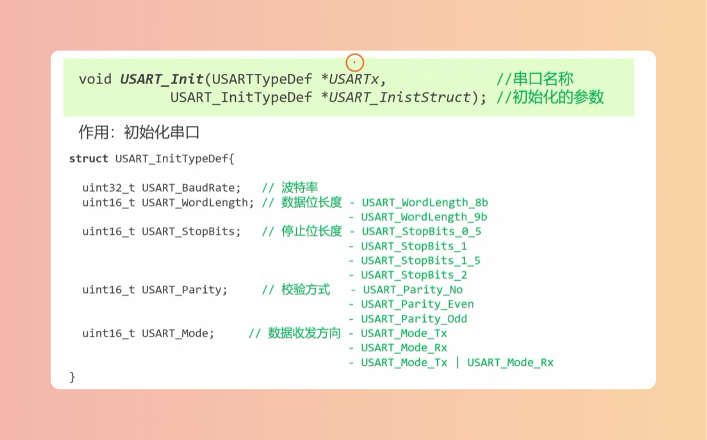

### TxRx
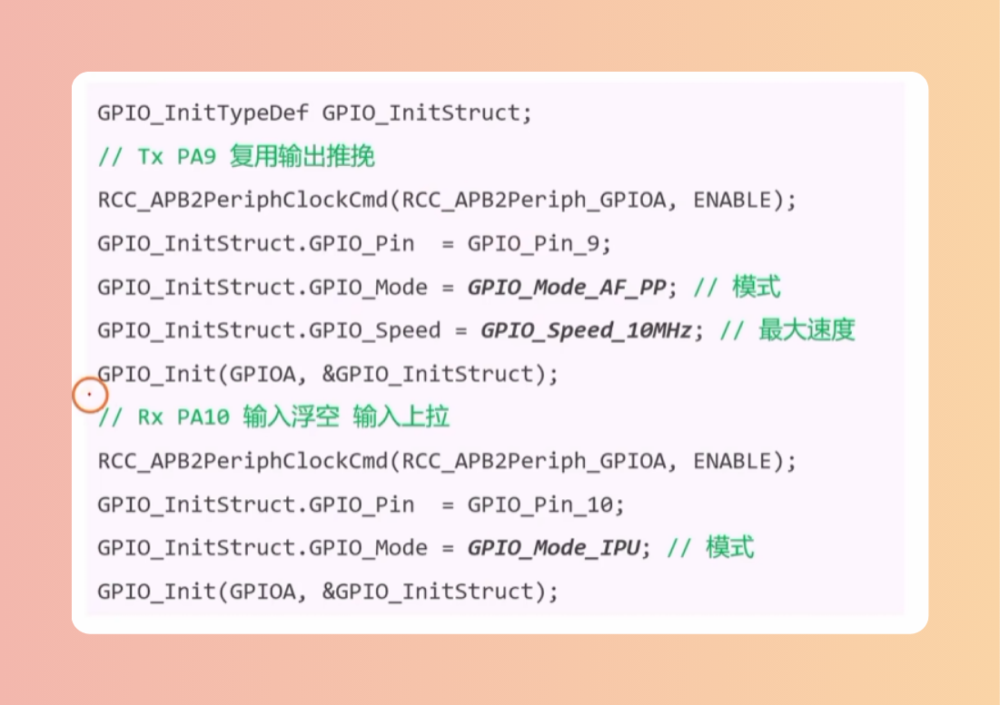
#### 重映射
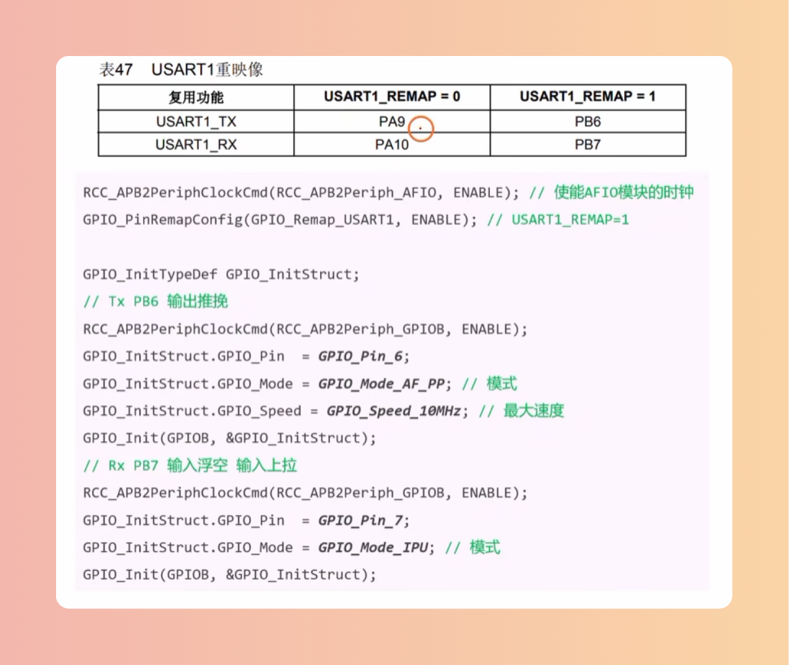