# 结构
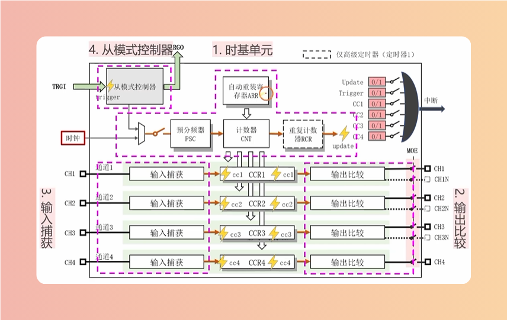

## 时基单元
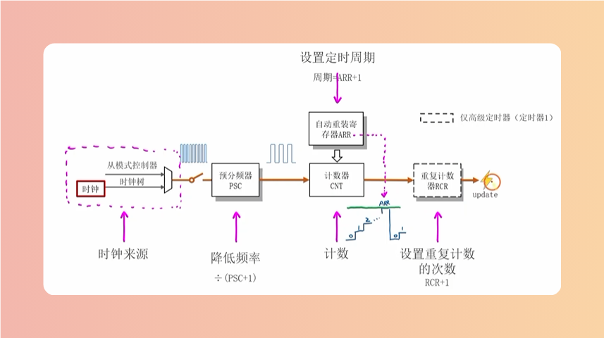

## 初始化时基单元
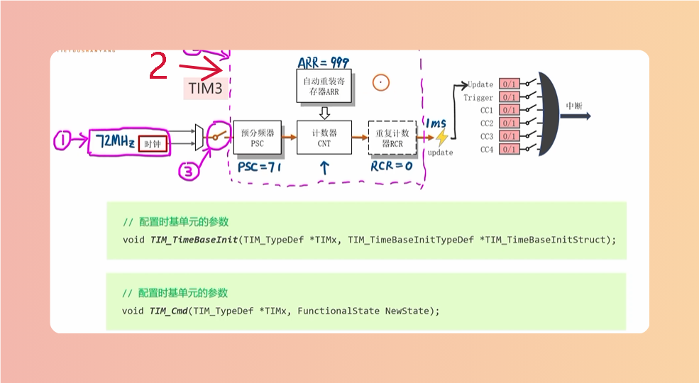

### 预分频器
PSC + 1

## 占空比
> 高电压/周期

## 捕获模式选择
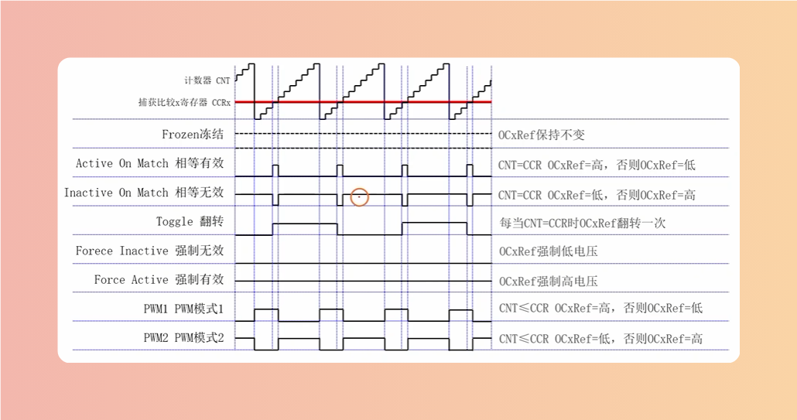

## 极性选择
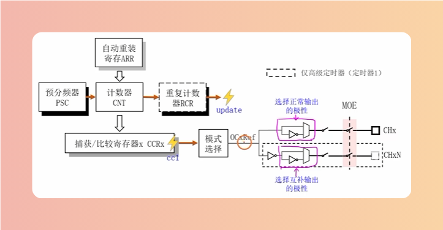

# 初始化
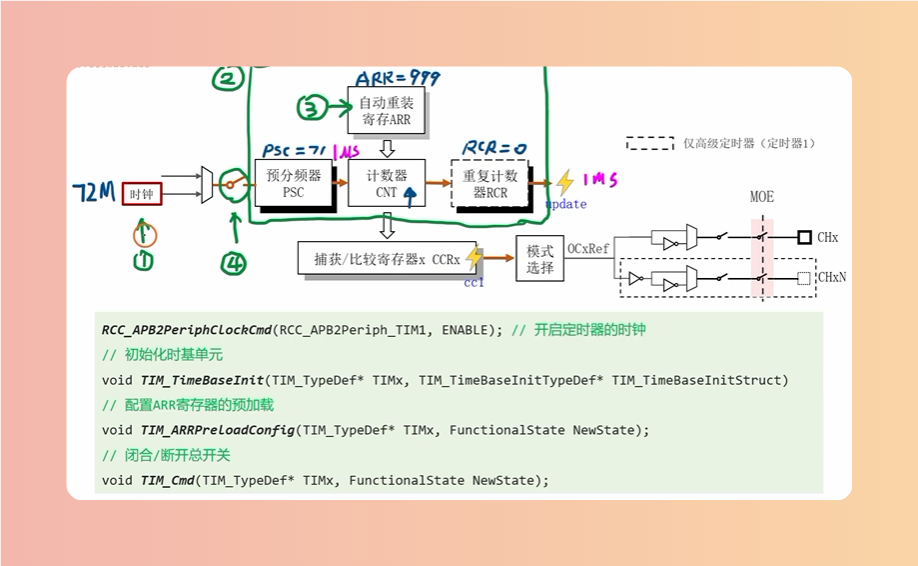

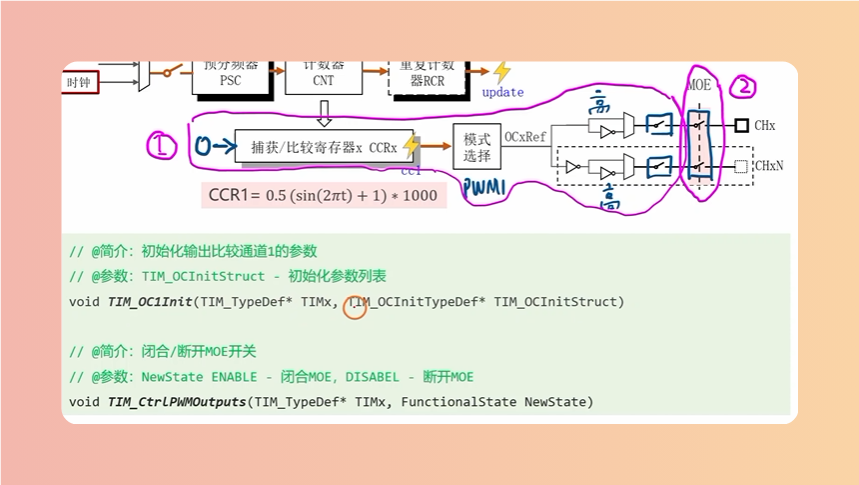

# CCR
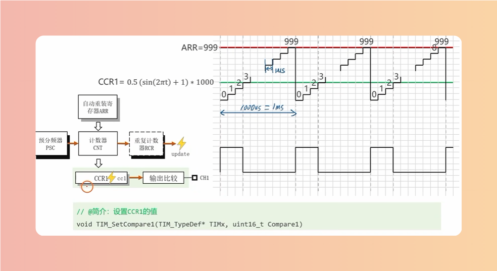

# 输入捕获
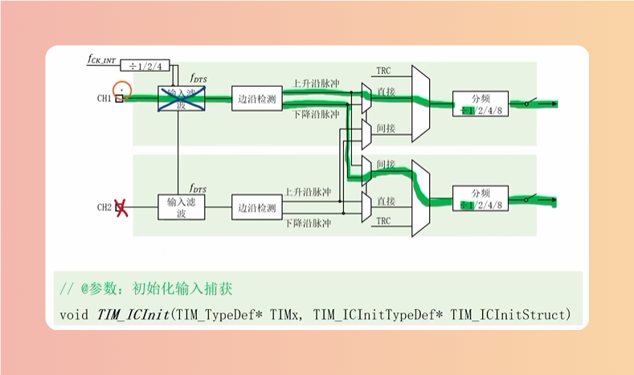

# 编程步骤
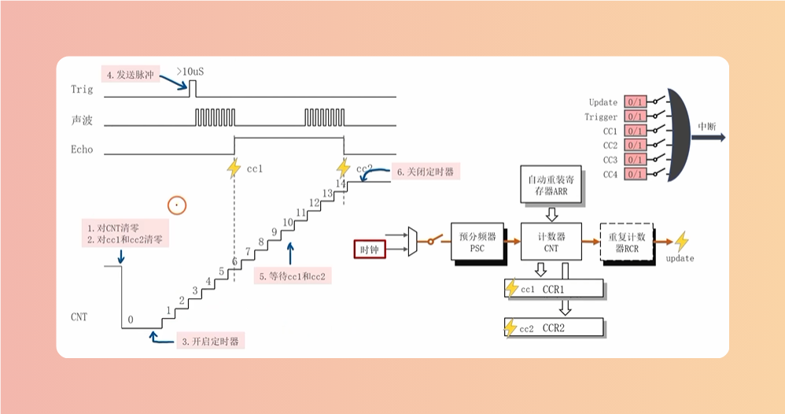

## TIM_SetCounter
> 对CNT计数器清零

## TIM_ClearFlag
> 清除定时器标志位

## TIM_Cmd
> 开启定时器

## TIM_GetFlagStatus
> 获取定时器标志位的一个状态

## TIM_Cmd
> 关闭定时器

## TIM_GetCapture
> 读取对应CCR的值

# 从模式控制器
> 接收控制信号控制时基单元，也可以发送信号去控制其他模块

## TIM_SelectInputTrigger
> 选择从模式控制器的触发输入

## TIM_SelectSlaveMode
> 选择TRGI模式

## 8种从模式
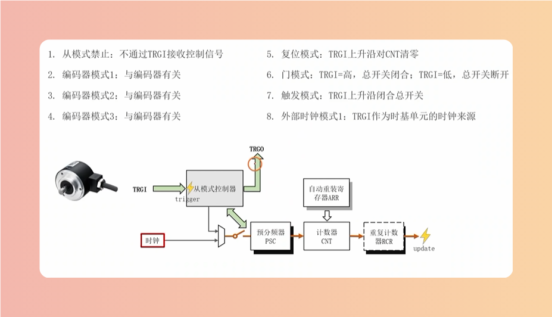

# 8种主模式
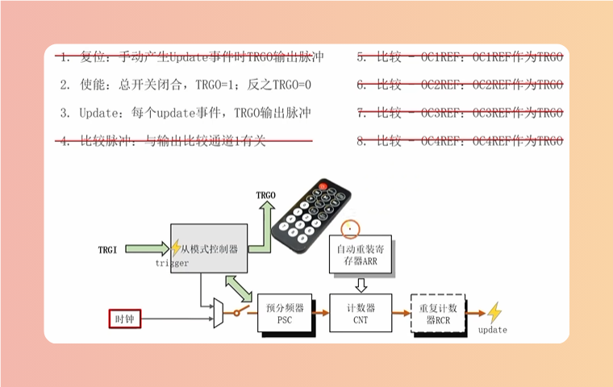

# PWM结构框图
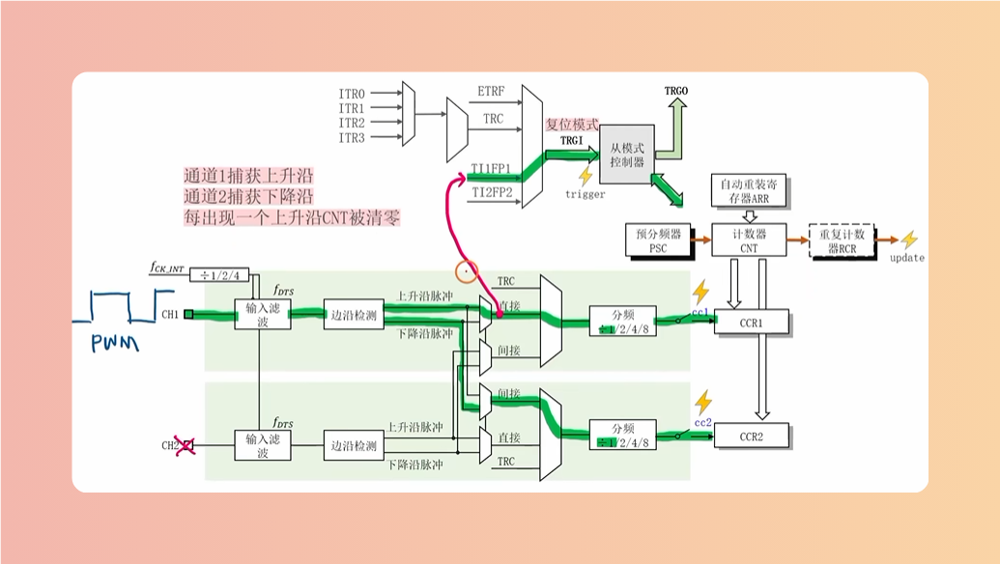

# PWM
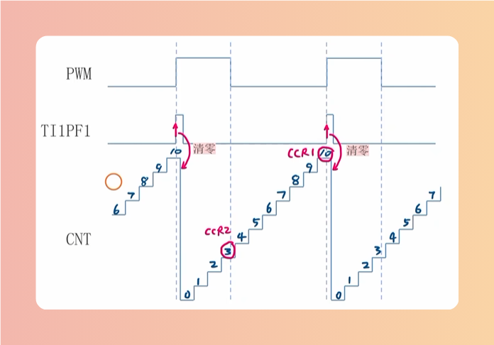

## 配置
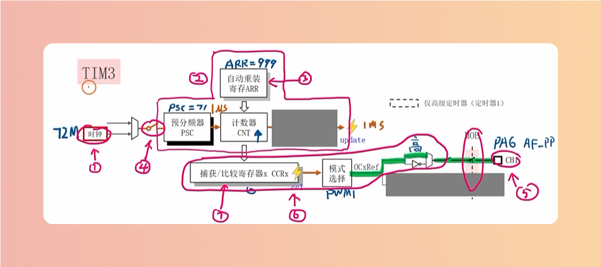