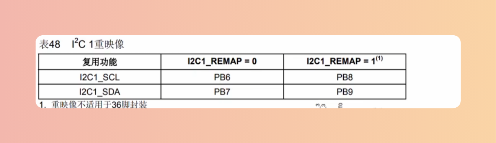
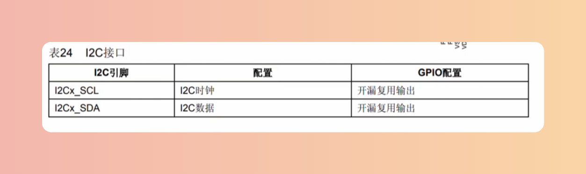

# 串口

## 引脚分布表
> DS5319 stm32f10x中等密度mcu数据手册（英文）P28

## 重映像
> RM0008 STM32F10xxx参考手册（中文）8.3节

## 引脚配置
> RM0008 STM32F10xxx参考手册（中文）8.1.11节

## APB1和APB2
> RM0008 STM32F10xxx参考手册（中文）7.3.4节

# I2C
## 重映像
> I2C1:RM0008 STM32F10xxx参考手册（中文）8.3节
> I2C2没有重映像

## 引脚分布表
> DS5319 stm32f10x中等密度mcu数据手册（英文）P30

## 引脚配置
> RM0008 STM32F10xxx参考手册（中文）8.1.11节

