# 1.新建工程文件夹
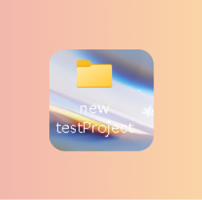

# 2. Keil新建工程
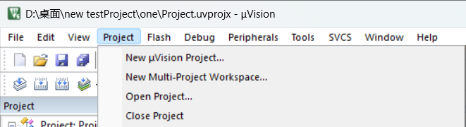

# 3.工程文件夹里对应建立Start,Library,User等同名称分组
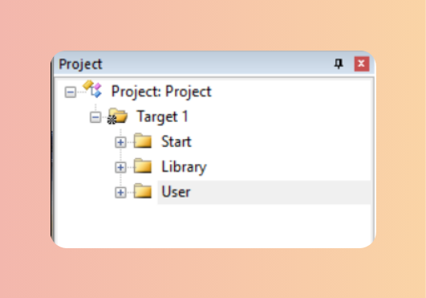

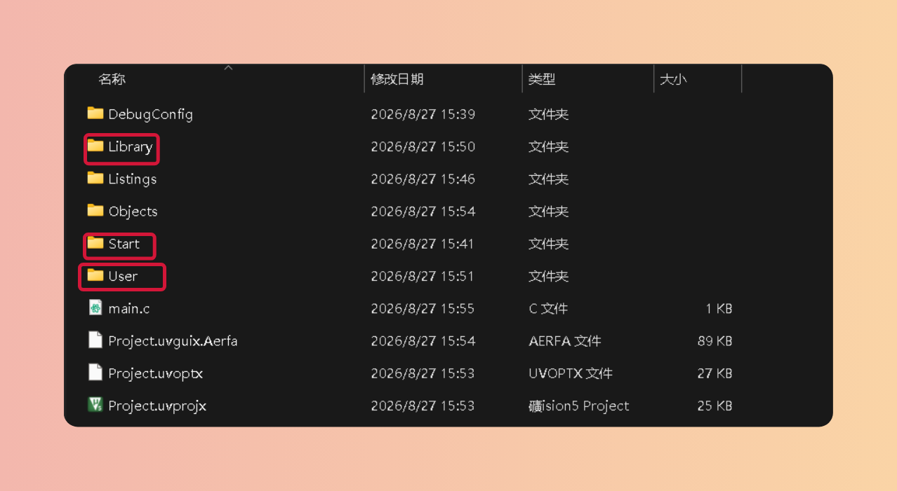
（main.c应该放在User目录下）
# 4.添加对应文件
> Library：在固件库Libraries\STM32F10x_StdPeriph_Driver目录下inc和src

> Start：STM32F10x_StdPeriph_Lib_V3.5.0\Libraries\CMSIS\CM3\DeviceSupport\ST\STM32F10x和STM32F10x_StdPeriph_Lib_V3.5.0\Libraries\CMSIS\CM3\CoreSupport

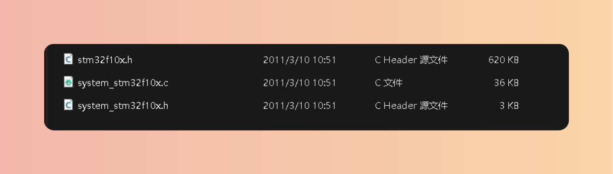

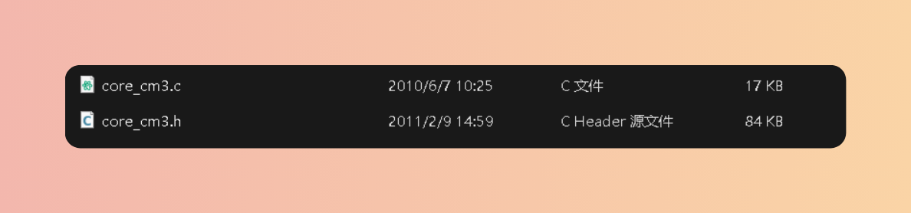

> 启动文件STM32F10x_StdPeriph_Lib_V3.5.0\Libraries\CMSIS\CM3\DeviceSupport\ST\STM32F10x\startup\arm（文件全复制，添加按照芯片型号选择缩写添加启动文件）
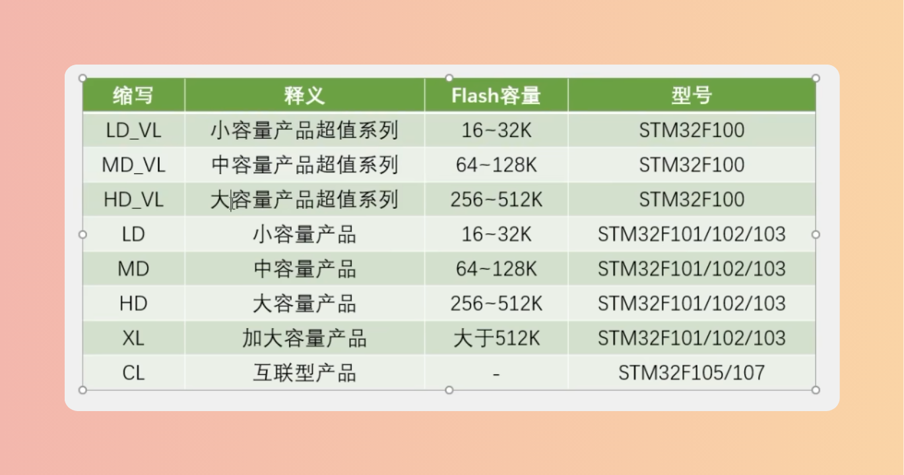

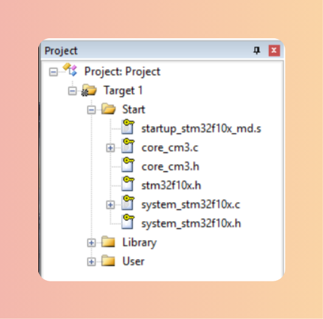

> User：STM32F10x_StdPeriph_Lib_V3.5.0\Project\STM32F10x_StdPeriph_Template

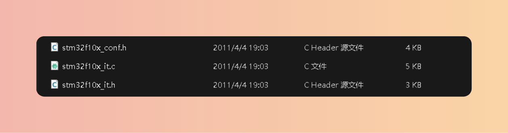

# 5.Keil软件配置
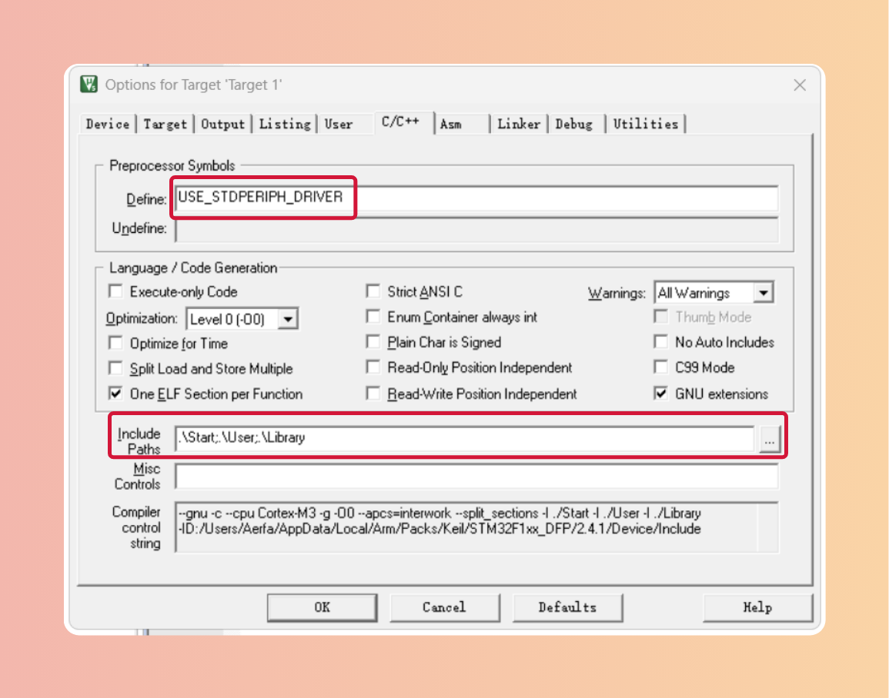
> 定义名在stm32f10x.h头文件

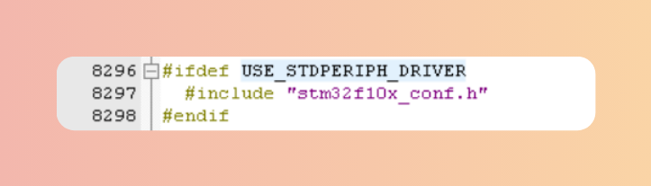
