# 时钟树
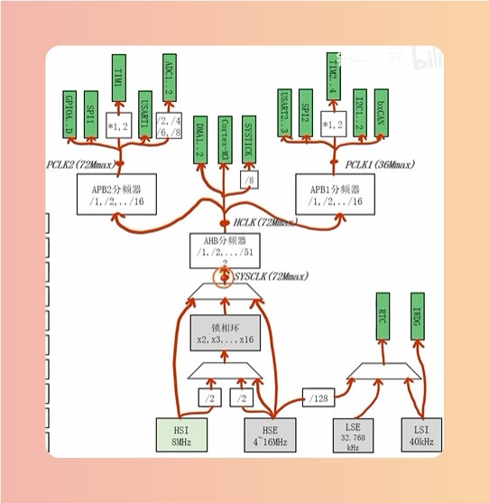

## 分频器
> 对频率做除法

## 锁相环
> 对频率做乘法

## 复用器
> 对频率做选择

# SYSCLK
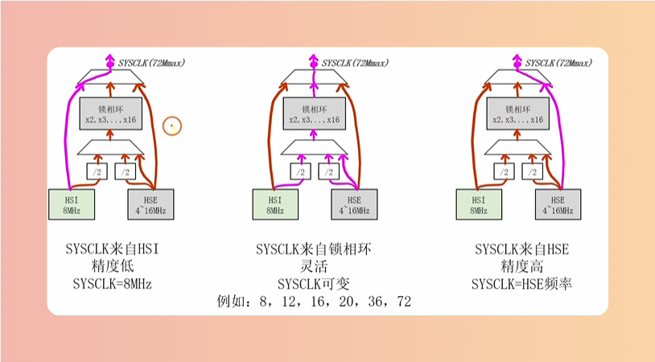

# 总线
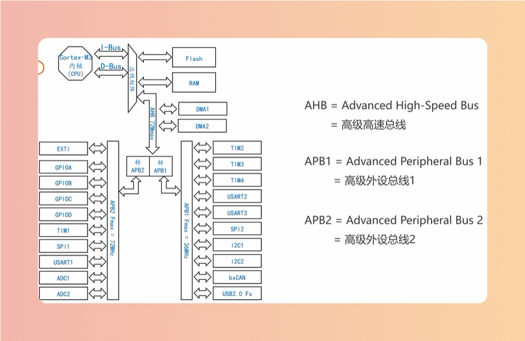

# 初始状态
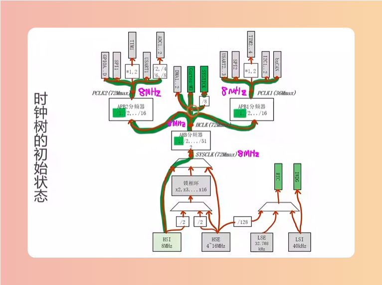

# 时钟树接口
> RCC复位和时钟控制器

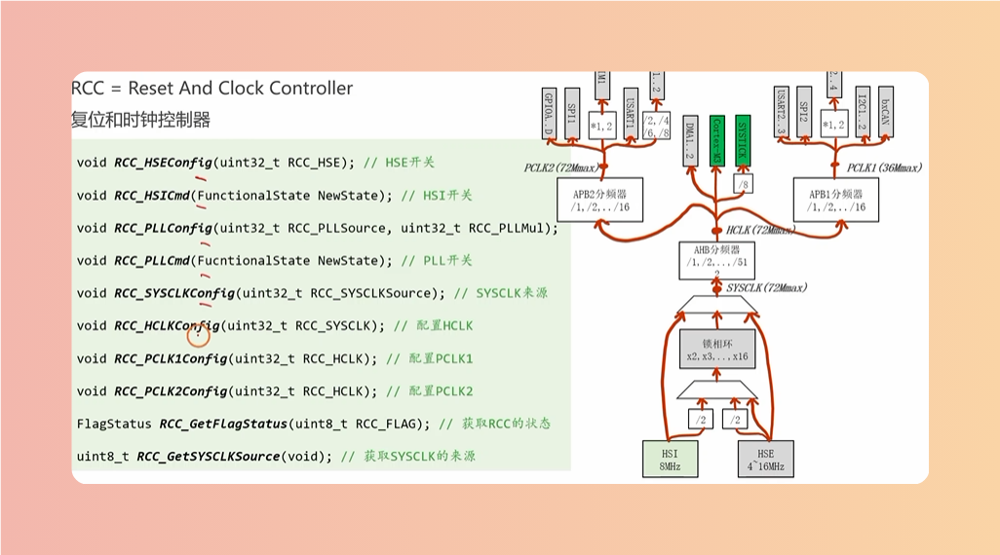

# 初始化流程
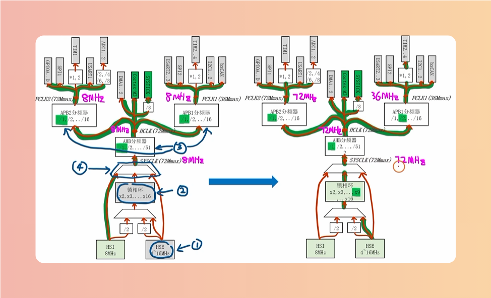

## 第一步：HSE
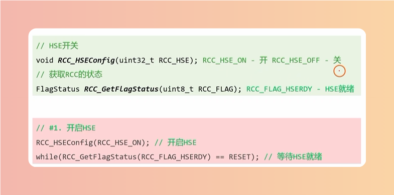

## 第二步：锁相环
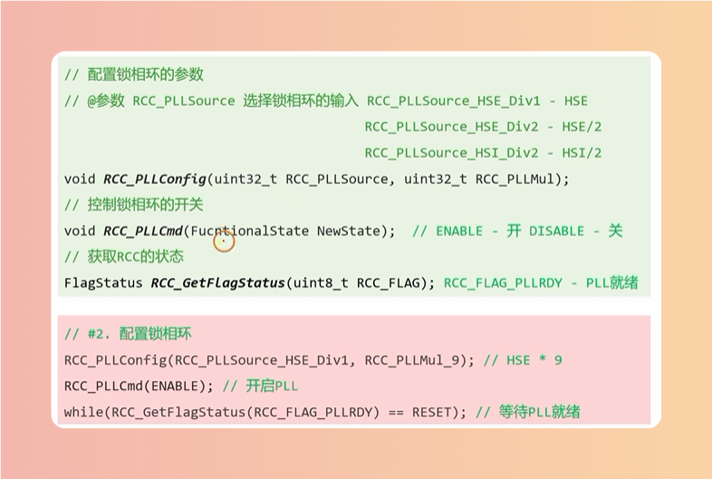

# 第三步：分频系数
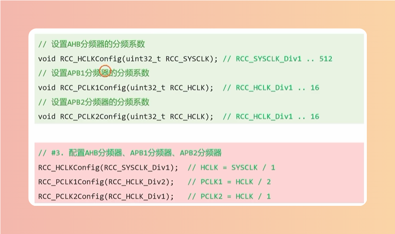

# 第四步：切换SYSCLK至锁相环
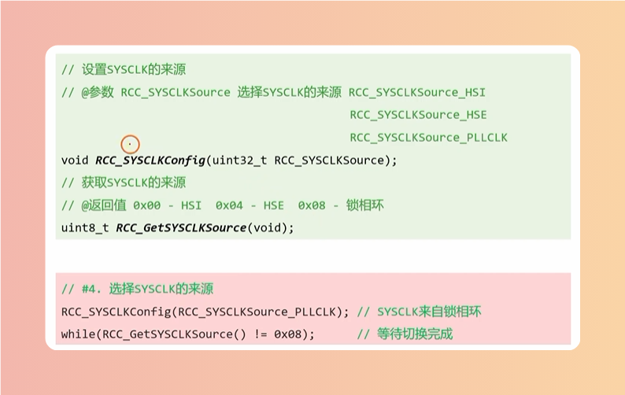

# 指令预取
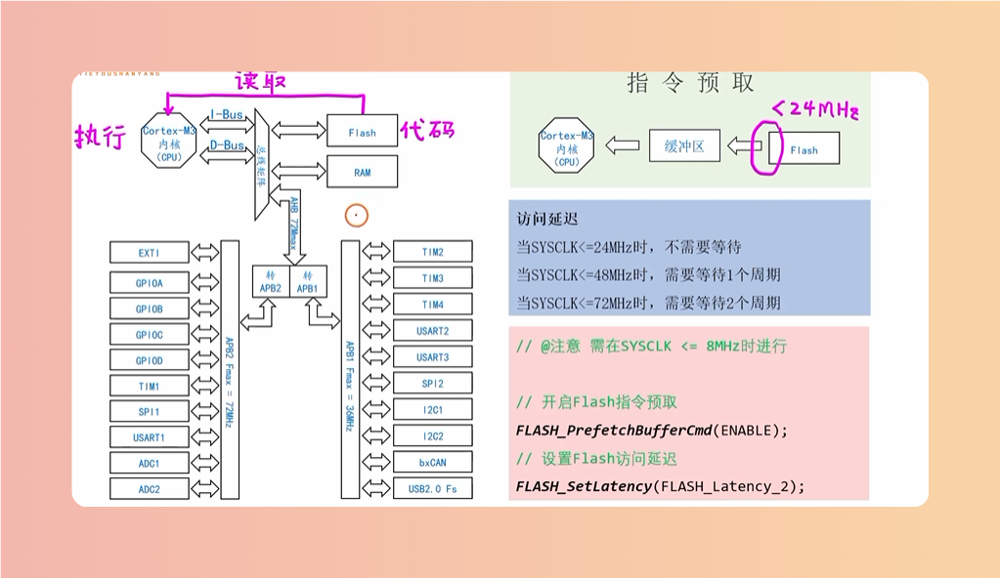

# 对片上外设进行开关和复位
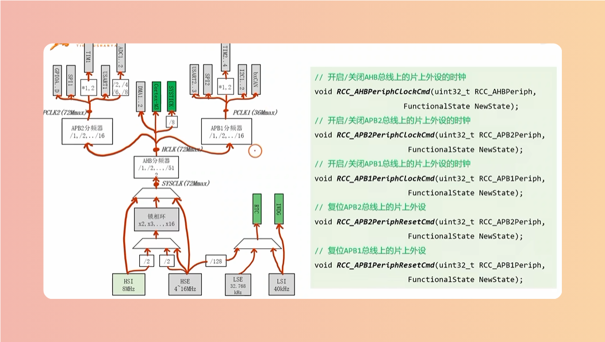