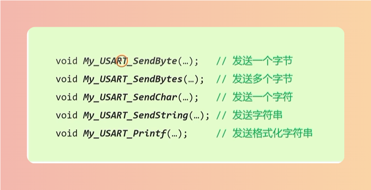
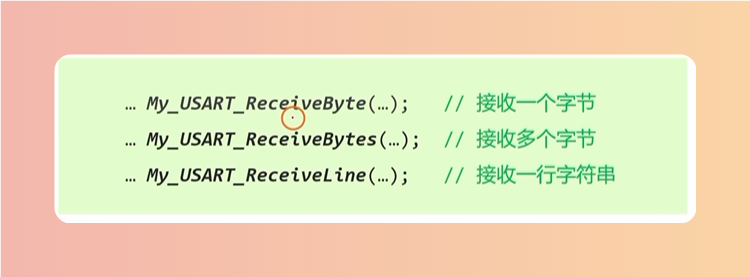

# USART
## 发送
> SendByte：0x01 - 0x02
> SendBytes：数组
> SendChar：’a‘字符
> SendString：“Hello World”字符串
> Printf：fputc函数

## 接收
> ReceiveByte：0x01 - 0x02
> ReceiveBytes：数组
> ReceiveLine：“Hello World”字符串

