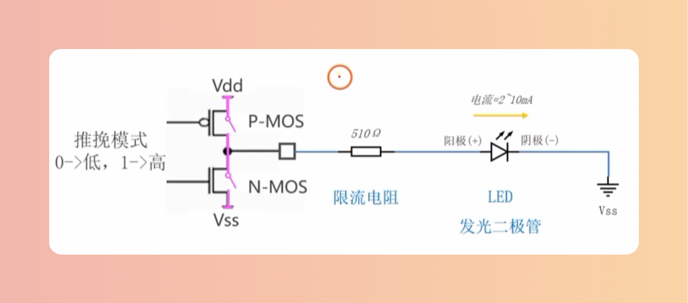
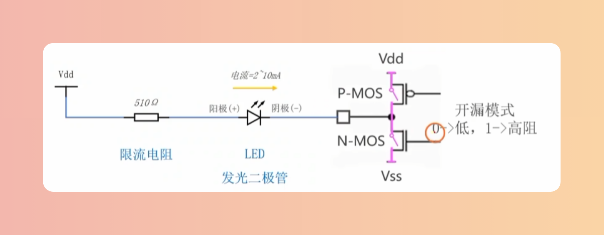
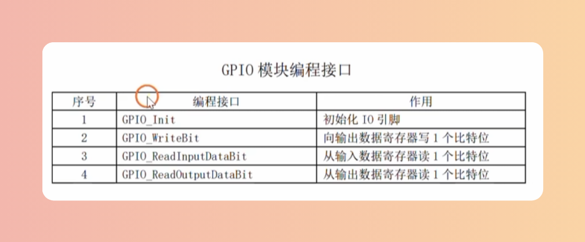
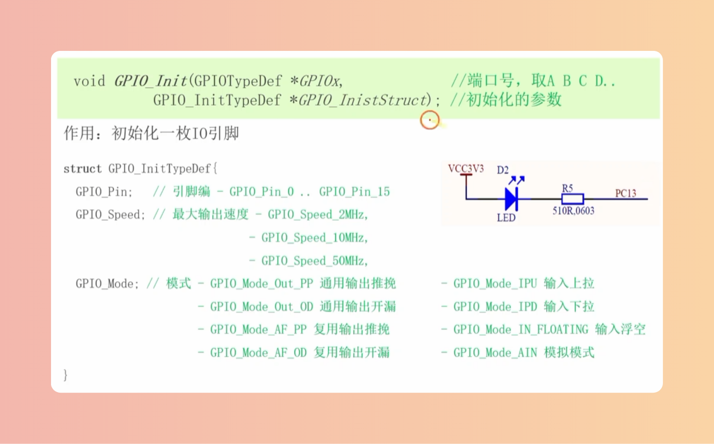
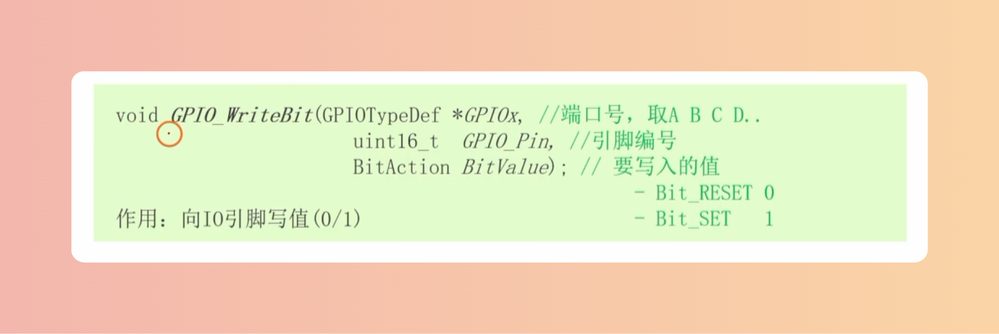

# GPIO
> 37个GPIO,分别为PA0-PA15、PB0-PB15、PC13-PC15、PD0-PD1

# GPIO的8种工作模式
## 推挽
PN结交替导通，不可以同时导通，0低1高

## 开漏
P管默认断开，0低1悬空高阻抗

## 什么限制了IO的最大输出速度
上升时间和下降时间

## GPIO模块编程接口

## GPIO_Init

## GPIO_WriteBit

